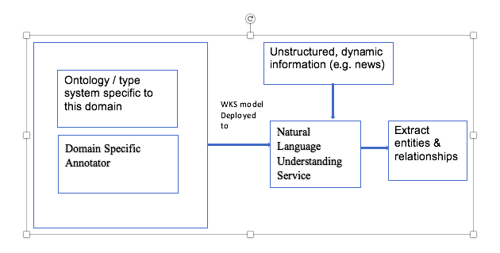
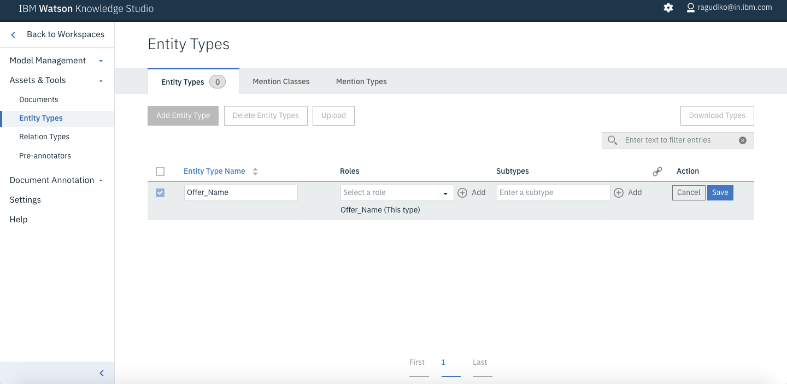
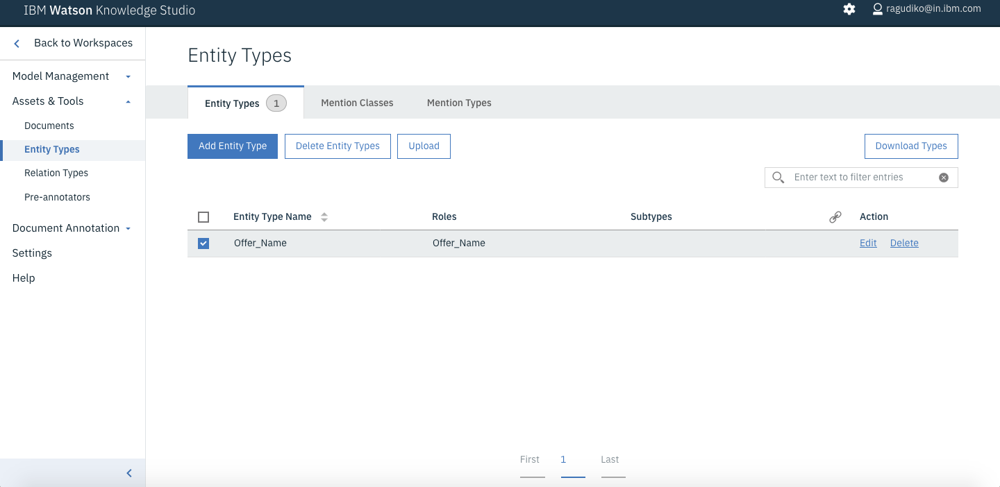
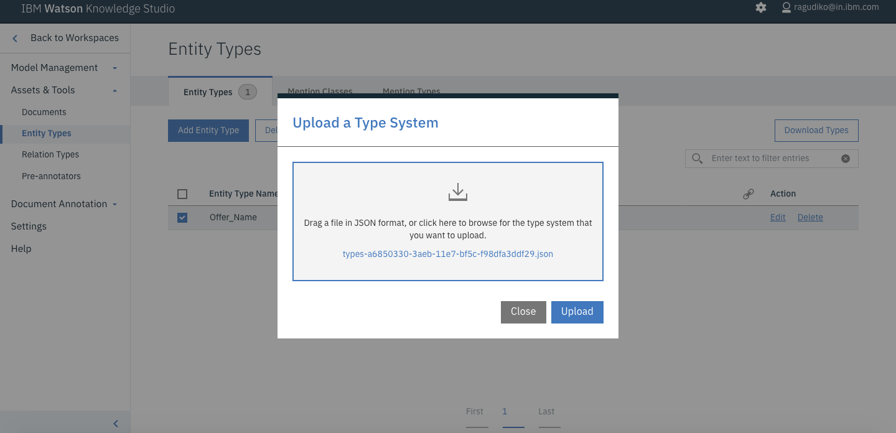
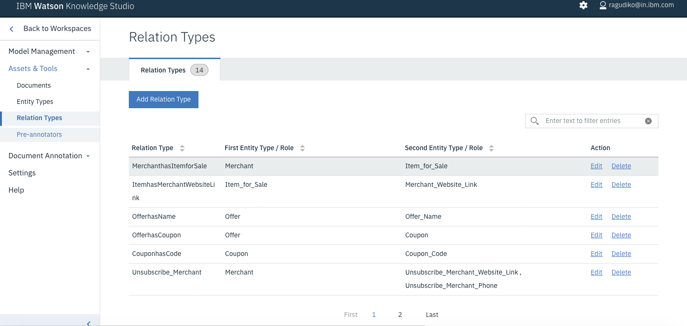
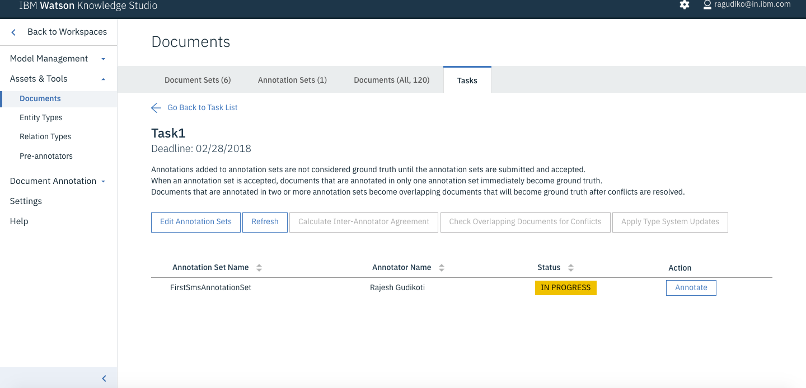
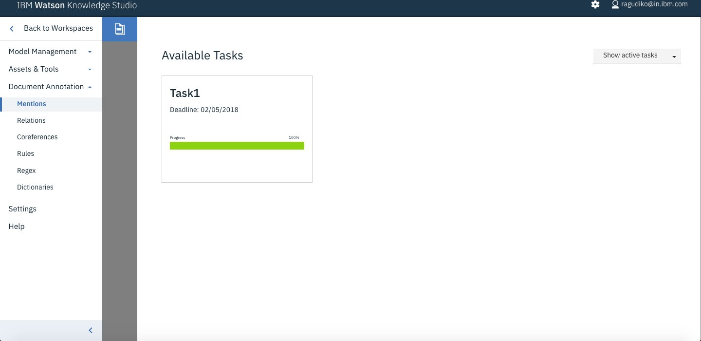
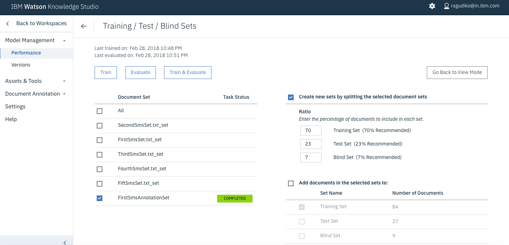
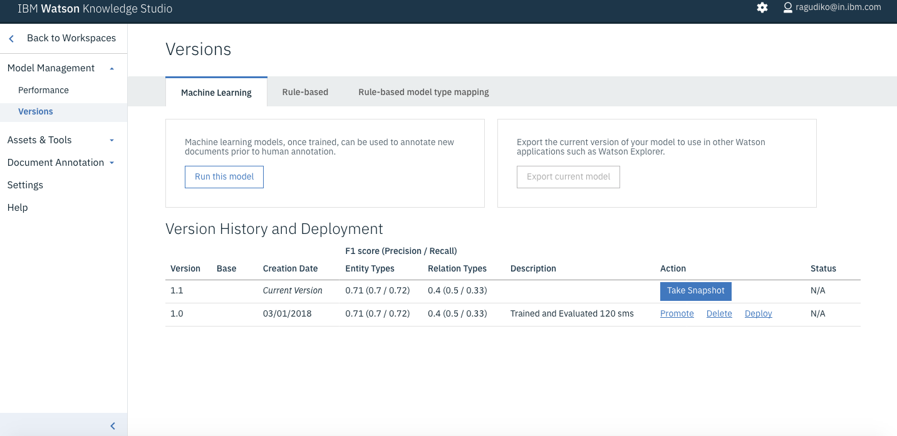

# wks-nlu-sms-analysis


This is cognitive sms client which uses natural language understanding capability to analyze the sms and extracts entity data required.

Background: Current natural language processing techniques cannot extract/interpret the data as required by domain/industry specific. The data(entities) represent different meaning in different domain. Best answer to such problem is IBM Watson Knowledge Studio.
Consider an example where we need to extract entities present in commercial sms.
In such commercial sms usually interesting entities to be extracted are
1. what is the offer
2. who is providing(merchant)
3. offer name(if present in sms)
4. offer validity period

We can also additional info like merchant name, merchant location, merchant website, merchant phone number in case this info is available in sms.

The above requirement can be achieved by using our cognitive sms analysis.

## Maven
If Apache Maven is being used, the following dependency should be included:
```xml
<dependency>
    <groupId>com.ibm.watson.developer_cloud</groupId>
    <artifactId>java-sdk</artifactId>
    <version>1.0</version>
</dependency>
```

## Process Flow


## Technical Architecture




## Features
1. User can feed sms to NLU which has machine learning model deployed in it.
2. The NLU analyzes the sms and extracts the domain specific entities.
3. The extracted entities will provide info like what is the offer, who is providing offer and offer valid date etc.

## Create NLU service


## Create WKS model and deploy the model to nlu
1. Create wks service instance


2. Create workspace


3. Create Type System (Step 3 is provided for reference, you can go directly to step 4)




4. Import Type System





5. Upload Documents (Step 5 is provided for reference, you can go directly to step 6)


6. Import Corpus Documents


7. Create Annotation Set


8. Create Task for Human Annotation


### Select Annotation Set for this task





### Start Human Annotation clicking Annotate button


### Submit Annotation Set for which human annotation is complete





### Create model, train and evaluate




### Deploy the Machine Learning model to NLU




Usage
You can run simple java client provided in this project to extract the entities from sms.

Alternatively you can use the curl commands.

NLU without wks model

curl -u "username":"password" "https://gateway.watsonplatform.net/natural-language-understanding/api/v1/analyze?version=2017-02-27&text=DUNKI%20DONUTS%20is%20now%20open%20at%20Girgaum%20Chowpatty.%20Walk-in%20and%20enjoy%20the%20Valentaine%20SPL%20offer%20on%20your%20favorite%20Donuts.%20Buy%203%20%26%20Get%203%20FREE.%20Valid%20till%2015%20Feb%202017.%20T%26C&features=entities"

Output:{ "language": "en", "entities": [ { "type": "Company", "text": "DUNKI DONUTS", "relevance": 0.976076, "count": 1 }, { "type": "GeographicFeature", "text": "Girgaum Chowpatty", "relevance": 0.65276, "count": 1 } ] }
The api is able to capture company(merchant) and location which are generic entities. It fails to extract the offer details as per our expectation.

NLU with WKS model

curl -u "username":"password" "https://gateway.watsonplatform.net/natural-language-understanding/api/v1/analyze?version=2017-02-27&text=DUNKI%20DONUTS%20is%20now%20open%20at%20Girgaum%20Chowpatty.%20Walk-in%20and%20enjoy%20the%20Valentaine%20SPL%20offer%20on%20your%20favorite%20Donuts.%20Buy%203%20%26%20Get%203%20FREE.%20Valid%20till%2015%20Feb%202017.%20T%26C&features=entities&entities.model=10:a5172791-b31b-4b0d-b546-3610ec652ca4"


Output:{ "language": "en", "entities": [ { "type": "Merchant", "text": "DUNKI DONUTS", "count": 1 }, { "type": "Location", "text": "Girgaum", "count": 1 }, { **"type": "Offer", "text": "Get 3 FREE", "count": 1 }, { "type": "Offer_Period", "text": "Valid till 15 Feb 2017", "count": 1 }, { "type": "Term_and_Conditions", "text": "T&C",** "count": 1 } ] }

### If we look the entities extracted in the form of json, we got the domain specific entities like offer, offer period, merchant. The model I used is trained and evaluated based on few sample sms. The sample sms are available under data folder.

Once you build wks model and NLU api service you can replace username/password highlighted with your NLU service credentials. Replace wks model id(entities.model) with your wks model id. The sms text has to be URL encoded as it is passed as url query string in Curl command.

## Run JUnits using maven command
Download Maven : https://maven.apache.org/download.cgi

Install Maven: https://maven.apache.org/install.html

Configure maven: Open .bash_profile if exists, else create new .bash_profile file. Make below entries into .bash_profile file.

-- -- entry starts

JAVA_HOME=/Library/Java/JavaVirtualMachines/jdk1.7.0_40.jdk/Contents/Home

export JAVA_HOME


M2_HOME=/usr/local/apache-maven/apache-maven-3.1.1

export M2_HOME

PATH=$PATH:$JAVA_HOME/bin:$M2_HOME/bin

export PATH

-- -- entry ends

Now from terminal run below command

mvn test

# Get your hands on with the NLU api and WKS tool
You can register at https://console.bluemix.net to access NLU.

You can try free version of WKS by logging into https://console.bluemix.net and select knowledge studio service under Watson

## Additional Resource
You can refer https://github.com/rameshpoomalai/ProcurementSystem for procurement use case where we have used WKS, Discovery and IBM Graph.

## Deploy the App

   [](https://bluemix.net/deploy?repository=https://github.com/ragudiko/wks-nlu-sms-analysis)
