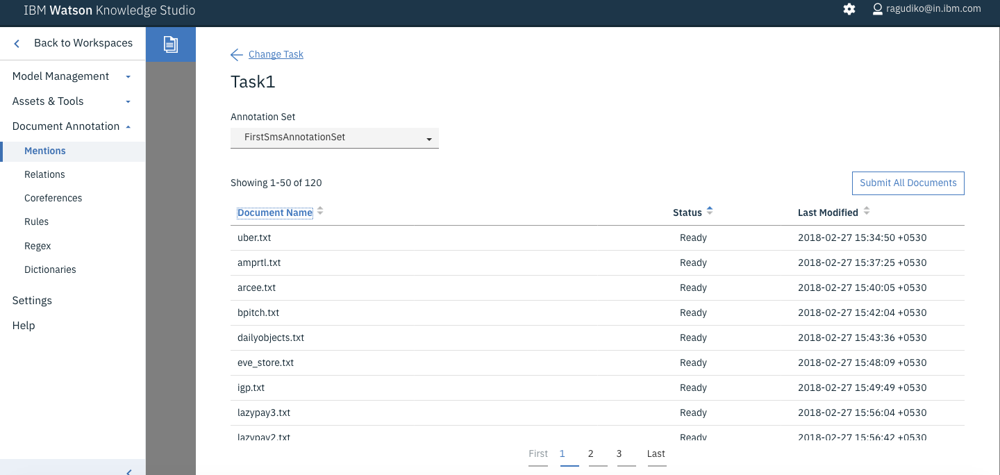
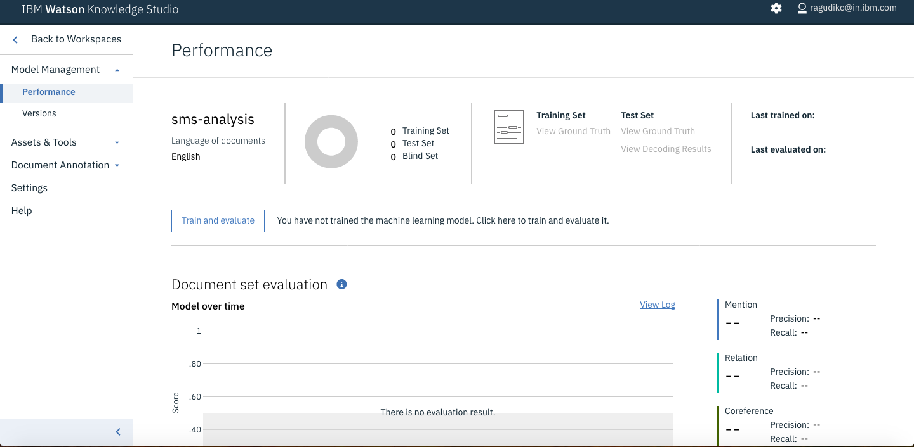
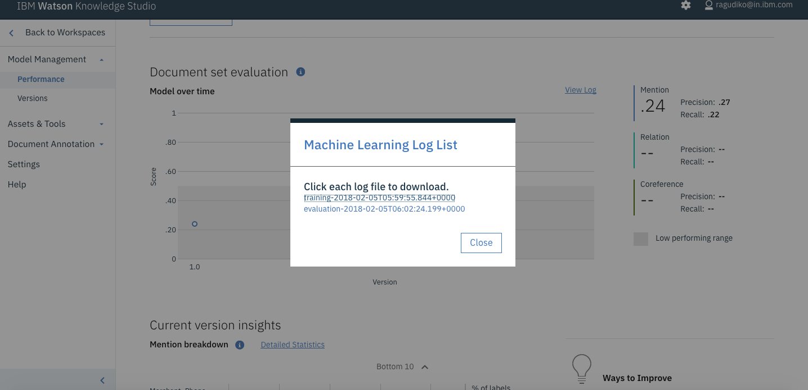
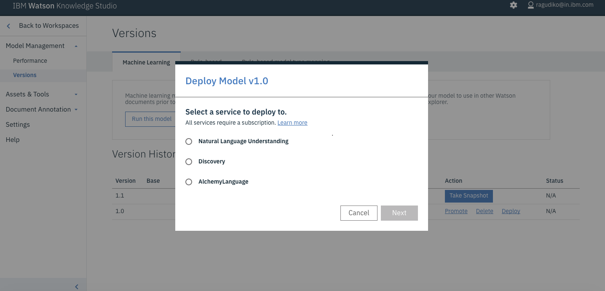

@@ -19,20 +19,20 @@ The above requirement can be achieved by using our cognitive sms analysis.
## Maven
If Apache Maven is being used, the following dependency should be included:
```xml
  	<dependency>
  		<groupId>com.ibm.watson.developer_cloud</groupId>
  		<artifactId>java-sdk</artifactId>
  		<version>1.0</version>
  	</dependency> 	
<dependency>
    <groupId>com.ibm.watson.developer_cloud</groupId>
    <artifactId>java-sdk</artifactId>
    <version>1.0</version>
</dependency>
```

## Process Flow


## Technical Architecture


## Features
@@ -41,95 +41,94 @@ If Apache Maven is being used, the following dependency should be included:
3. The extracted entities will provide info like what is the offer, who is providing offer and offer valid date etc.

## Create NLU service


## Create WKS model and deploy the model to nlu
1. Create wks service instance


2. Create workspace


3. Import Type System navigating to wks-resources/types-a6850330-3aeb-11e7-bf5c-f98dfa3ddf29.json


4. Import Corpus Documents navigating to wks-resources/corpus-a6850330-3aeb-11e7-bf5c-f98dfa3ddf29.zip
### If you do not want corpus documents, you can fresh documents. For beginners we recommend to upload the corpus documents.


5. Create Annotation Set


6. Create Task for Human Annotation


### Select Annotation Set for this task





### Start Human Annotation clicking Annotate button
### Since we imported corpus documents in step 4, we have already have annotation done for you. You can look at entities and relationships already annotated. You can annotate mentions (occurrences of words/phrases which can be annotated as entity) to play around or you can modify by annotating mention with different entity.


7. Submit Annotation Set for which human annotation is complete


8. Create model, train and evaluate






9. Deploy the Machine Learning model to NLU





