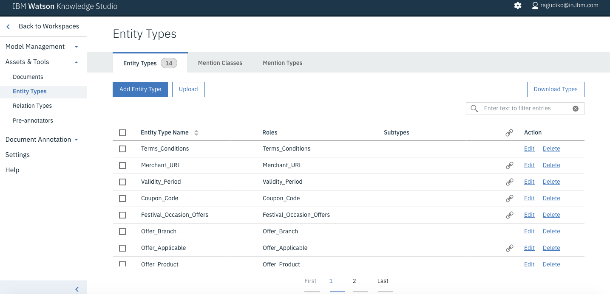
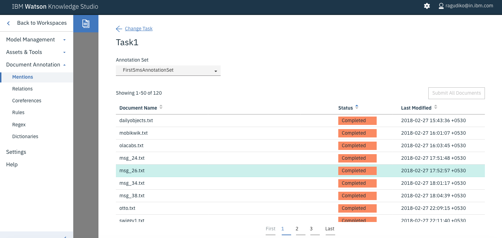
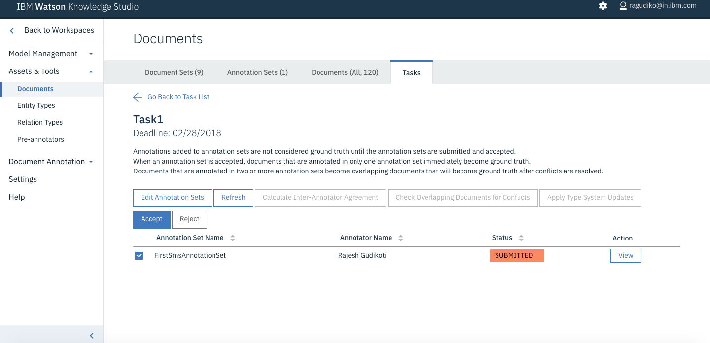
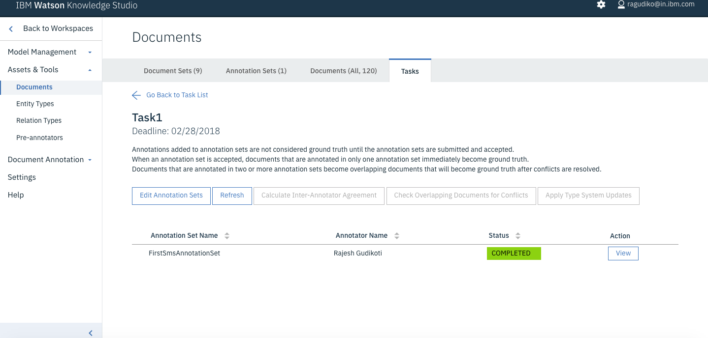
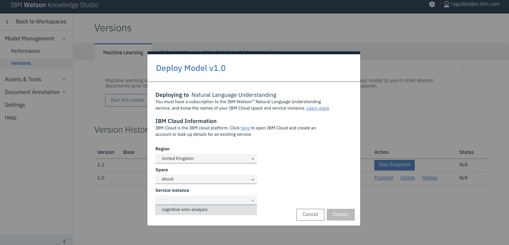

# Analyzing SMS messages with Watson Knowledge Studio


<!--

-->

This code pattern describes how to analyze SMS messages with Watson Knowledge Studio (WKS) and Waton's Natural Language Understanding (NLU) capability to extract entities in the data. Current natural language processing techniques cannot extract or interpret data that is domain or industry specific. The data (entities) represent different meaning in different domains. The best answer to such a problem is IBM's Watson Knowledge Studio. Consider a case where we need to extract entities present in a commercial SMS. For example:

```
PIZZA! Don't Cook Wednesdays are here! Get 50% off a Medium Pizza.
Offer available for single Pizza in-store and two for Home Delivery.
Walk-In/Call @ 555-555-5555
```

The example above has a few interesting entities which could not be extracted with conventional NLP techniques, but by using Watson services we can find out the following:

1. What is the offer?
2. Who is the merchant?
3. What is the offer name?
4. What is the offer's validity period?
5. What is the merchant's phone number?
6. What is the merchant's website?

After completing this code pattern, the user will learn how to:

* Upload a corpus with WKS
* Import types to WKS
* Use WKS to create a model
* Deploy a WKS model to NLU
* Call NLU APIs with a WKS model specified

## Flow


1. The user provides an SMS message to be analyzed to a client.
2. The client sends the SMS to analzyed to Watson NLU, specifying which machine learning model to use in WKS.
3. Watson NLU extracts the domain specific entities and returns these results to the client.
4. The client renders the results to the user.

## Technical Architecture


## Included components

* [Watson Natural Language Understanding](https://www.ibm.com/watson/developercloud/natural-language-understanding.html): An IBM Cloud service that can analyze text to extract meta-data from content such as concepts, entities, keywords, categories, sentiment, emotion, relations, semantic roles, using natural language understanding.
* [Watson Knowledge Studio](https://www.ibm.com/watson/services/knowledge-studio/): Teach Watson the language of your domain with custom models that identify entities and relationships unique to your industry, in unstructured text. Use the models in Watson Discovery, Watson Natural Language Understanding, and Watson Explorer.

## Featured Technologies

* [Artificial Intelligence](https://medium.com/ibm-data-science-experience): Artificial intelligence can be applied to disparate solution spaces to deliver disruptive technologies.

# Watch the Video

TBD!

# Steps

1. [Clone the repo](#1-clone-the-repo)
2. [Create IBM Cloud services](#2-create-ibm-cloud-services)
3. [Create a Watson Knowledge Studio workspace](#3-create-a-watson-knowledge-studio-workspace)
4. [Upload Type System](#4-upload-type-system)
5. [Import Corpus Documents](#5-import-corpus-documents)
6. [Create an Annotation Set](#6-create-an-annotation-set)
7. [Create a Task for Human Annotation](#7-create-a-task-for-human-annotation)
8. [Create the model](#8-create-the-model)
9. [Deploy the machine learning model to NLU](#9-deploy-the-machine-learning-model-to-nlu)

## 1. Clone the repo

```
$ git clone https://github.com/IBM/sms-analysis-with-wks
```

## 2. Create IBM Cloud services

Create the following services:

* [**Watson Natural Language Understanding**](https://console.bluemix.net/catalog/services/natural-language-understanding)
* [**Watson Knowledge Studio**](https://console.bluemix.net/catalog/services/knowledge-studio)

## 3. Create a Watson Knowledge Studio workspace

Launch the **WKS** tool and create a new **workspace**.


## 4. Upload Type System

From the **Access & Tools -> Entity Types** panel, press the **Upload** button to import a **Type System** file. Use the file [wks-resources/types-a6850330-3aeb-11e7-bf5c-f98dfa3ddf29.json](wks-resources/types-a6850330-3aeb-11e7-bf5c-f98dfa3ddf29.json) found in the local repository.


This will download a set of **Entity Types** and **Relation Types**.




## 5. Import Corpus Documents

From the **Access & Tools -> Documents** panel, press the **Upload Document Sets** button to import a **Document Set** file. Use the corpus documents file [wks-resources/corpus-a6850330-3aeb-11e7-bf5c-f98dfa3ddf29.zip](wks-resources/corpus-a6850330-3aeb-11e7-bf5c-f98dfa3ddf29.zip) found in the local repository.

> NOTE: It is not necessary to use the provided corpus documents, but is recommended for beginners.


## 6. Create an Annotation Set

From the **Access & Tools -> Documents** panel, press the **Create Annotion Sets** button. Select a valid **Annotator** user, and provide a unique name for **Set name**. 


## 7. Create a Task for Human Annotation

From the **Access & Tools -> Documents** panel, select the **Task** tab and press the **Add Task** button. 


### 7.1 Select Annotation Set for this task

Select the **Annotation Set** you created in the previous step, and press the **Create Task** button.


Click on the task card to view the task details panel.


Click the **Annotate** button to start the **Human Annotation** task.


Click on any of the documents to view the SMS message. Click on the file icon in the top left corner to return to the document list. The example below shows as SMS message that has not been annotated.


Since we previously imported the corpus documents, the entity and relationship annotations are already completed and can be seen in the following examples. You can annotate mentions (occurrences of words/phrases which can be annotated as an entity) to play around, or you can modify one by annotating mentions with a different entity.


## 7.2 Submit Annotation Set

From the **Task** details panel, press the **Submit All Documents** button.


All documents should change status to **Completed**.



The **Task** panel will show that the percentage of completion for the task.


From the **Access & Tools -> Documents** panel, select the **Task** tab and select the task to view the details panel.


Select the **Annotation Set Name** and then press the **Accept** button.





## 8. Create the model

From the **Model Management -> Performance** panel, select the **Train and evaluate** button.


Select **All** and press the **Train & Evaluate** button. This may take several minutes.


Once complete, you can view log files of the process by clicking the **View Log** button.


## 9. Deploy the machine learning model to NLU

Now we can deploy our new model to the already created **NLU** service.




# Usage

## cURL

Using cURL is the quickest way to show the advantages of WKS. Let's see the result of using NLU with and without a WKS model.

### NLU with a WKS model

The important change to made to a regular cURL call to NLU is to add an `entities.model` argument to the query string. In the example below we see (`entities.model=10:a5172791-b31b-4b0d-b546-3610ec652ca4`) added. It's clear in the server response that we can see domain specific entities like `Offer`, `Offer_Period`, and `Merchant`.

To do this yourself, replace `username` and `password` with your own NLU credentials, and the WKS model ID, `entities.model` with your own WKS model ID. The SMS text is URL encoded as it is passed as a query argument. Note that the model used to train and evaluate entities is based on few sample SMS offers, which are available in the [data](data) folder.

```
curl -u "$username":"$password" \
"https://gateway.watsonplatform.net/natural-language-understanding/api/v1/analyze?version=2017-02-27&text=DUNKI%20DONUTS%20is%20now%20open%20at%20Girgaum%20Chowpatty.%20Walk-in%20and%20enjoy%20the%20Valentaine%20SPL%20offer%20on%20your%20favorite%20Donuts.%20Buy%203%20%26%20Get%203%20FREE.%20Valid%20till%2015%20Feb%202017.%20T%26C&features=entities&entities.model=10:a5172791-b31b-4b0d-b546-3610ec652ca4"

{
    "language": "en",
    "entities": [{
        "type": "Merchant",
        "text": "DUNKI DONUTS",
        "count": 1
    }, {
        "type": "Location",
        "text": "Girgaum",
        "count": 1
    }, {
        "type": "Offer",
        "text": "Get 3 FREE",
        "count": 1
    }, {
        "type": "Offer_Period",
        "text": "Valid till 15 Feb 2017",
        "count": 1
    }, {
        "type": "Term_and_Conditions",
        "text": "T&C",
        "count": 1
    }]
}
```

### NLU without a WKS model

Using NLU without a WKS is less ideal. The server does not extract the entities we are looking for, it extracts the company and some location details, both of which are generic, it does not extract the offer details we desiree.

```
curl -u "$username":"$password" \
"https://gateway.watsonplatform.net/natural-language-understanding/api/v1/analyze?version=2017-02-27&text=DUNKI%20DONUTS%20is%20now%20open%20at%20Girgaum%20Chowpatty.%20Walk-in%20and%20enjoy%20the%20Valentaine%20SPL%20offer%20on%20your%20favorite%20Donuts.%20Buy%203%20%26%20Get%203%20FREE.%20Valid%20till%2015%20Feb%202017.%20T%26C&features=entities"

{
    "language": "en",
    "entities": [{
        "type": "Company",
        "text": "DUNKI DONUTS",
        "relevance": 0.976076,
        "count": 1
    }, {
        "type": "GeographicFeature",
        "text": "Girgaum Chowpatty",
        "relevance": 0.65276,
        "count": 1
    }]
}
```

## Java Client

You can run the simple java client provided in this project to extract the entities from SMS messages.

## Testing

JUnit tests are run using [maven](https://maven.apache.org/download.cgi). To configure maven, open `.bash_profile` if it exists (create a new `.bash_profile` otherwise), and add the entry below:

```
JAVA_HOME=/Library/Java/JavaVirtualMachines/jdk1.7.0_40.jdk/Contents/Home
export JAVA_HOME
M2_HOME=/usr/local/apache-maven/apache-maven-3.1.1
export M2_HOME
PATH=$PATH:$JAVA_HOME/bin:$M2_HOME/bin
export PATH
```

If Apache Maven is being used, the following dependency should be included:

```xml
<dependency>
    <groupId>com.ibm.watson.developer_cloud</groupId>
    <artifactId>java-sdk</artifactId>
    <version>1.0</version>
</dependency>
<dependency>
    <groupId>com.ibm.watson.developer_cloud</groupId>
    <artifactId>java-sdk</artifactId>
    <version>1.0</version>
</dependency>
```

From a terminal run the command below from the root directory of the repository:

```
mvn test
```

# Deploy the App

[](https://bluemix.net/deploy?repository=https://github.com/IBM/sms-analysis-with-wks)

# Learn more

* **Artificial Intelligence Code Patterns**: Enjoyed this Code Pattern? Check out our other [AI Code Patterns](https://developer.ibm.com/code/technologies/artificial-intelligence/).
* **AI and Data Code Pattern Playlist**: Bookmark our [playlist](https://www.youtube.com/playlist?list=PLzUbsvIyrNfknNewObx5N7uGZ5FKH0Fde) with all of our Code Pattern videos
* **With Watson**: Want to take your Watson app to the next level? Looking to utilize Watson Brand assets? [Join the With Watson program](https://www.ibm.com/watson/with-watson/) to leverage exclusive brand, marketing, and tech resources to amplify and accelerate your Watson embedded commercial solution.
* [Procurement Analysis with WKS](https://github.com/IBM/procurement-analysis-with-wks): Another code pattern that is focused on a procurement use case where WKS is used with Discovery and IBM Graph.

# License

[Apache 2.0](LICENSE)
